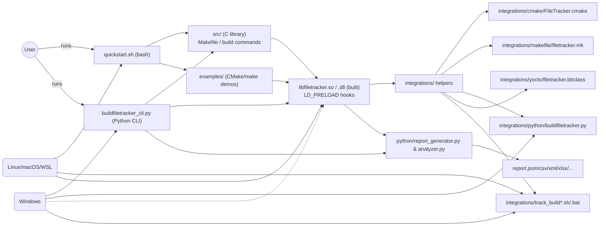

# Architecture Overview

This document provides a high-level map of the BuildFileTracker project, showing entry points, core components, integrations, examples, and how they relate across operating systems.

## Entry Points

1. **quickstart.sh** – shell script for a guided demo.
2. **buildfiletracker_cli.py** – Python command‑line interface for tracking, reporting, and analysis.

## Core Components

* **src/**: C library providing interception via LD_PRELOAD (or equivalent on Windows).
* **integrations/**: Helper modules and scripts for various build systems (CMake, Makefile, Yocto, Python).
* **examples/**: Demonstration projects used by quickstart and documentation.
* **python/**: Report generator and analysis tools.

## Workflow

1. build the tracker library (`make` in `src/`).
2. run a build command with the library preloaded (via wrapper or CLI).
3. tracker captures file accesses and writes raw JSON.
4. run Python report/analyzer tools to convert or inspect the data.
5. review outputs (JSON, CSV, XML, XLSX, summary text).

## Platform Notes

* Linux/macOS/WSL: full support with `LD_PRELOAD` and shell wrappers.
* Windows: limited native support; usually used via Python CLI or WSL.
