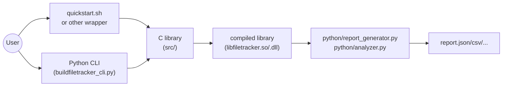
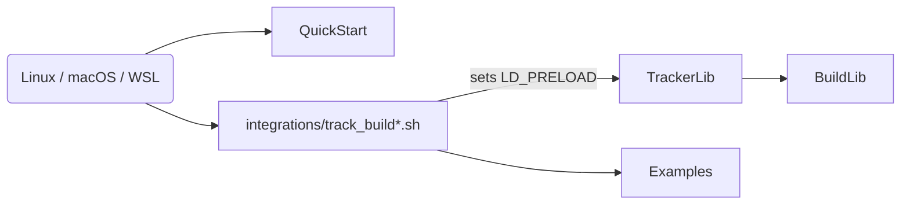
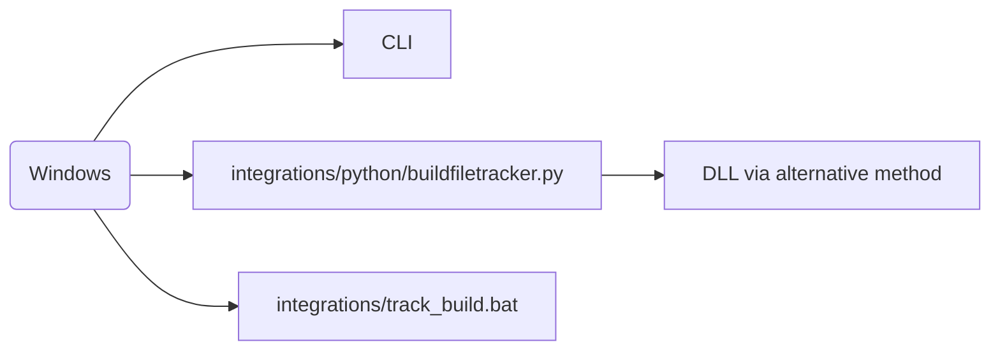
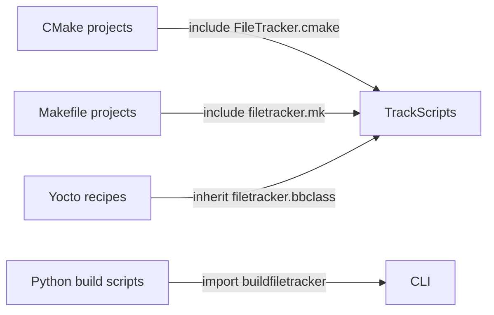

# Architecture Overview

This document shows how the pieces of BuildFileTracker fit together.  It uses simple pictures and short sentences so even a school kid can follow along.

---

## 1. Core flow (abstract view)

A simplified overview showing the high‑level progression from user entry to reports.

There are two ways to start:

* run the `quickstart.sh` script, or
* run the Python program `buildfiletracker_cli.py`.

Both ways first make the small C library, then run your build.  The library watches which files get opened.  After the build finishes, Python makes reports from the data.

---

## 2. Platform-specific paths

### Linux / macOS / WSL

On Linux, macOS, or WSL you run a shell script.  The script sets a special variable (`LD_PRELOAD`) so the tracker library loads when your build runs.  The small helper files are in the `integrations/` folder.

### Windows

Windows does not support the tracker the same way.  You usually use the Python helper or run everything inside WSL.

---

## 3. Build-system integrations

Different build tools (CMake, Make, Yocto, Python) have their own tiny helper files.  You add the helper to your project when you want to track its build.

The `integrations/` directory contains:
- `cmake/FileTracker.cmake`
- `makefile/filetracker.mk`
- `python/buildfiletracker.py`
- `yocto/filetracker.bbclass` and wrapper scripts (`track_build.sh`, `track_build.bat`, `track_build_universal.sh`)

For example, when you run `make all`, the helper makes sure the tracker library starts and writes its data file.

---

## 4. Examples & documentation

The `examples/` folder contains simple CMake and Makefile projects that demonstrate how to integrate the tracker. The quick‑start script exercises these automatically.

Documentation files such as this one, plus the user guide and integration guide, live under `docs/`.

---

## 5. Summary workflow (ordered steps)

1. **Build the tracker library**: run `make` in `src/` (generates `libfiletracker.so` or `.dll`).
2. **Choose entry point**: invoke `quickstart.sh`, a wrapper script, or the Python CLI.
3. **Start tracking**: the chosen entry point loads the library or backend and runs your build command.
4. **Gather data**: file accesses are recorded into a JSON file specified by `FILE_TRACKER_JSON`.
5. **Generate reports**: run `python/report_generator.py` (or use CLI `report` command) to create various output formats.
6. **Analyze**: optionally run `python/analyzer.py` or CLI `analyze` for insights.

---

Look at the pictures to see which files you need to use.  They show where to find the scripts and helpers for each platform.