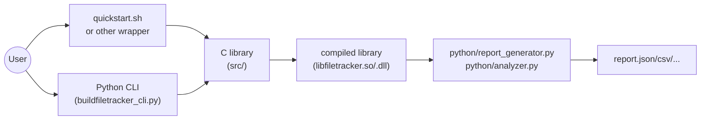
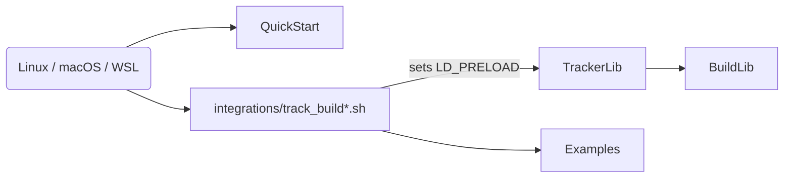
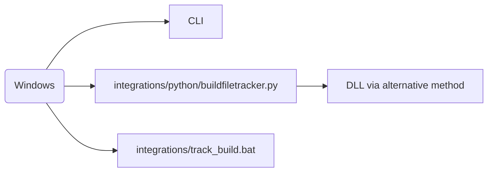
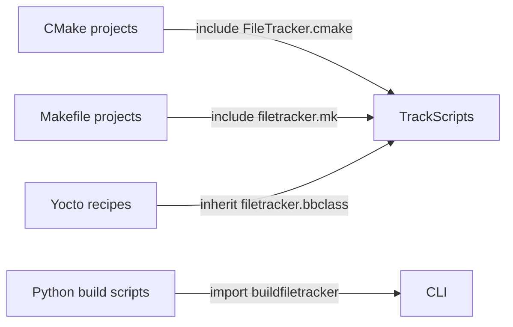

# Architecture Overview

This document provides a clear, step-by-step overview of how the BuildFileTracker project is structured and how its components interact. Diagrams are divided by platform and build system to make navigation easier.

---

## 1. Core flow (abstract view)

A simplified overview showing the high‑level progression from user entry to reports.

The two main entry points are the shell quick‑start script and the Python command‑line tool. Both ultimately require building the C library, which performs interception, and both produce raw tracking data that the Python tools convert into various report formats.

---

## 2. Platform-specific paths

### Linux / macOS / WSL

On Unix‑like systems you generally use a shell script or set `LD_PRELOAD` directly. Wrapper scripts and CMake/Makefile helpers live under `integrations/`.

### Windows

Native Windows support is limited; tracking is typically performed via the Python integration or using WSL.

---

## 3. Build-system integrations

Each build system has its own helper file or snippet; these are not entry points themselves but are included by your project when you want to enable tracking.

The `integrations/` directory contains:
- `cmake/FileTracker.cmake`
- `makefile/filetracker.mk`
- `python/buildfiletracker.py`
- `yocto/filetracker.bbclass` and wrapper scripts (`track_build.sh`, `track_build.bat`, `track_build_universal.sh`)

When your project invokes a build rule (e.g. `make all`), these helpers ensure the tracker library is loaded and environment variables are set.

---

## 4. Examples & documentation

The `examples/` folder contains simple CMake and Makefile projects that demonstrate how to integrate the tracker. The quick‑start script exercises these automatically.

Documentation files such as this one, plus the user guide and integration guide, live under `docs/`.

---

## 5. Summary workflow (ordered steps)

1. **Build the tracker library**: run `make` in `src/` (generates `libfiletracker.so` or `.dll`).
2. **Choose entry point**: invoke `quickstart.sh`, a wrapper script, or the Python CLI.
3. **Start tracking**: the chosen entry point loads the library or backend and runs your build command.
4. **Gather data**: file accesses are recorded into a JSON file specified by `FILE_TRACKER_JSON`.
5. **Generate reports**: run `python/report_generator.py` (or use CLI `report` command) to create various output formats.
6. **Analyze**: optionally run `python/analyzer.py` or CLI `analyze` for insights.

---

The diagrams above are intended to help you locate the relevant files when you want to integrate BuildFileTracker with your own build system or extend support to a new platform.